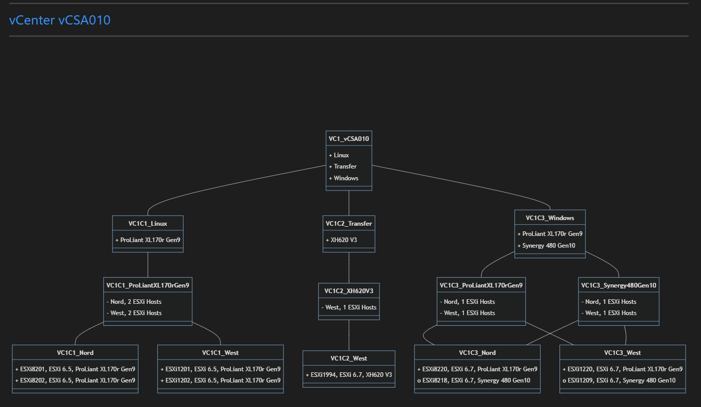
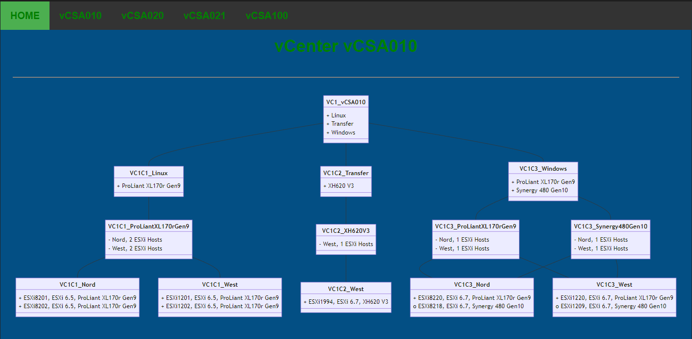
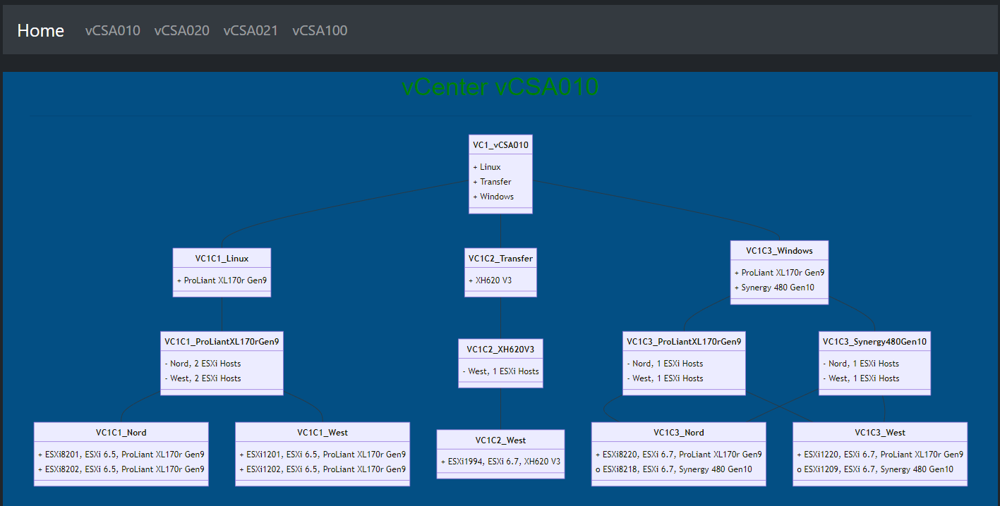
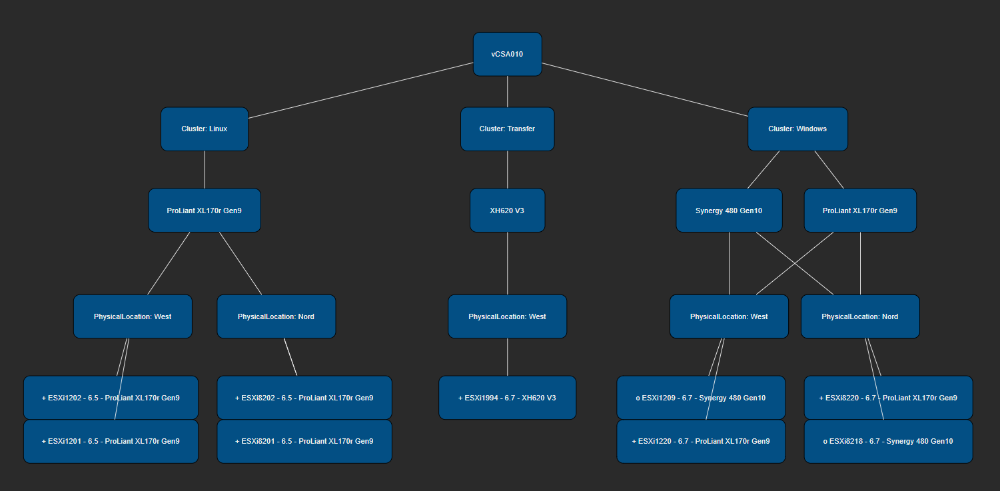

# PsMwaDiagram

PsMwaDiagram builds Diagrams with PowerShell and save it as Markdown-, HTML- or as CSV-File for Draw.IO.

 - [Markdown Class Diagram](#markdown-class-diagram)
 - [HTML Class Diagram](#html-class-diagram)
 - [PSHTML Class Diagram](#pshtml-class-diagram)
 - [Draw.IO Diagram](#drawio-diagram)

## Markdown Class Diagram

Build a simple Class Diagram from an object of VMware ESXiHosts as Markdown-File.



Import the data from a CSV-file and create a Mermaid-Class-Diagram with the content of the object and save it as Markdown.

````PowerShell
Set-Location .\PsMwaDiagram\bin
$Parameters = @{
    InputObject = Import-Csv -Path ..\data\inventory.csv -Delimiter ';'
    Title       = 'Markdown ESXiHost Inventory'
}
.\New-VCSADiagram.ps1 @Parameters
````

[Top](#)

## HTML Class Diagram

Build a simple Class Diagram from an object of VMware ESXiHosts as HTML-File.



Import the data from a CSV-file and create a Mermaid-Class-Diagram with the content of the object save it as Html.

CSS and Html is inside the Html-Page and the Computer must have access to the Internet to mermaid.min.js to format the Diagrams.

````PowerShell
Set-Location .\PsMwaDiagram\bin
$Parameters = @{
    InputObject = Import-Csv -Path ..\data\inventory.csv -Delimiter ';'
    Title       = 'HTML ESXiHost Inventory'
    Html        = $true
}
.\New-VCSADiagram.ps1 @Parameters 
````

[Top](#)

## PSHTML Class Diagram

[PSHTML is a cross platform powershell module that allows to renders HTML using powershell syntax](https://pshtml.readthedocs.io/en/latest/)

````PowerShell
Install-Module PSHTML
````

Build a simple Class Diagram from an object of VMware ESXiHosts. It use PSHTML and BootStrap for the layout of the Page.



Import the data from a CSV-file and create a Mermaid-Class-Diagram with the content of the object as Html with PSHTML.

All libraries are included in the project in the assets-folder and no access to the Internet is needed.

````PowerShell
Set-Location .\PsMwaDiagram\bin
$Parameters = @{
    InputObject = Import-Csv -Path ..\data\inventory.csv -Delimiter ';'
    Title       = 'PSHTML ESXiHost Inventory'
    Pshtml      = $true
}
.\New-VCSADiagram.ps1 @Parameters 
````

[Top](#)

## Draw.io Diagram

Create CSV-File(s) to [import into draw.io](https://drawio-app.com/import-from-csv-to-drawio/).



````PowerShell
Set-Location .\PsMwaDiagram\bin
$Parameters = @{
    InputObject = Import-Csv -Path ..\data\inventory.csv -Delimiter ';'
    Title       = 'DrawIO ESXiHost Inventory'
    DrawIO      = $true
}
.\New-VCSADiagram.ps1 @Parameters 
````

Open Draw.IO -> Create New Diagram -> Choose Blank Diagram -> Arrange -> Insert -> Advanced -> CSV...

Copy and paste the Content of the created CSV-File into the Form-Filed and press Import. Arrange the elements as you like.

[Top](#)
