# PSXi

We currently have ~150 ESXi Hosts across 12 vCenters in our environemnt. Whenerver I'm done with the visualization of it, it's already wrong and I can start again. Why doesn't PowerShell do this for me? That's why I wrote this framework.

- [PSXiDiag](#psxidiag)
  - [How it works](#how-it-works)
  - [PSXi Homepage](#psxi-homepage)
  - [PSXi Summary](#psxi-summary)
  - [PSXi ESXi Inventory](#psxi-esxi-inventory)
  - [Mermaid Diagram](#mermaid-diagram)
  - [See also](#see-also)

## How it works

ScriptRunner runs scheduled PowerShell-Scripts to collect all the data of all vCenters and send it over WinRM as CSV-files to the Pode-Server. The Pode-Server has a FileWatcher where it check for new CSV-files in /pode/input.

The file should be named:
- cloud_ESXiHosts.csv
- classic_ESXiHosts.csv
- cloud_Summary.csv
- classic_Summary.csv

The content of the CSV-file will be stored in a SQLite DB in seperated tabels for Cloud and Classic. You can access over Pode.Web to the SQLite DB and get the properties of Cloud-/Classic ESXiHosts.

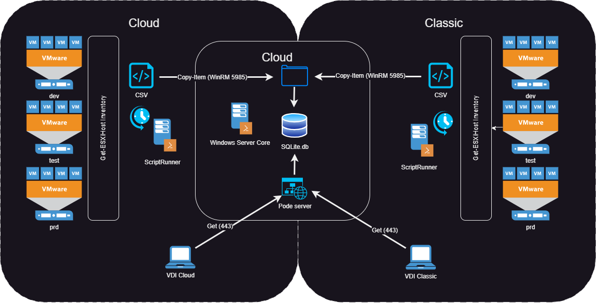

## PSXi Homepage

This is the Homepage of the PSXi App. It shows you the status of the Modules and the SQLite Database, Tables and Views.

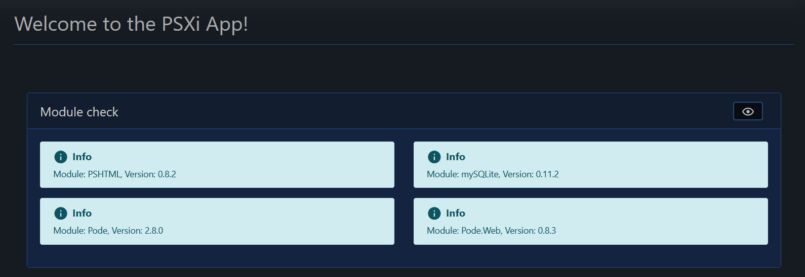
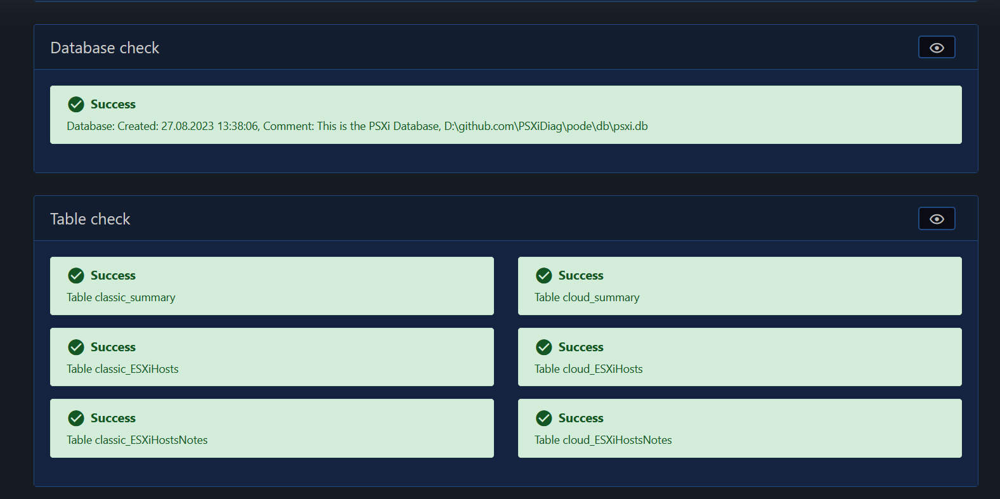
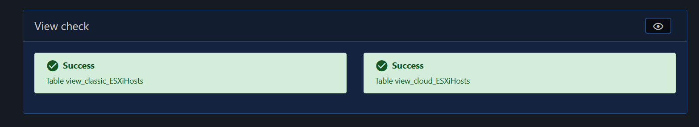

## PSXi Summary

In the Summary, you can see the total of vCenter, and the count of each ESXiHost versions.

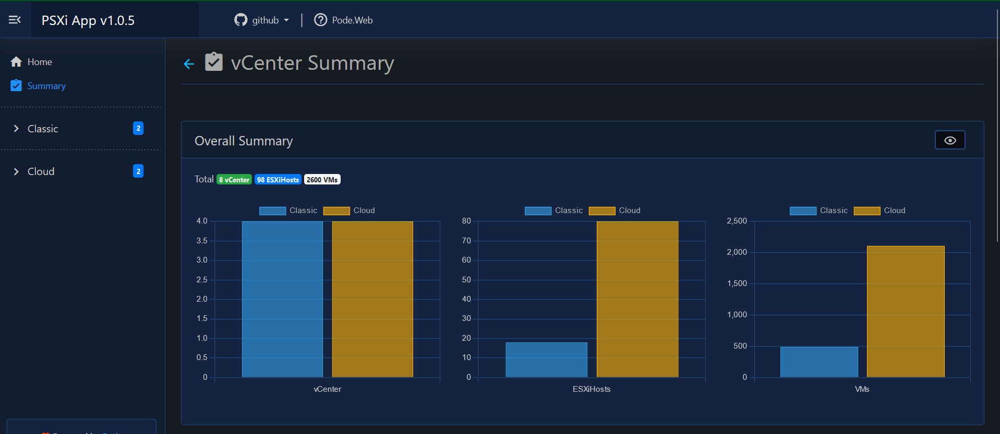
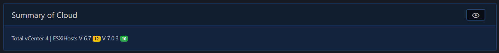

## PSXi ESXi Inventory

If you click on the Group Classic and Classic ESXi Host Inventory, the first you can see is the summary of objects in this environment.

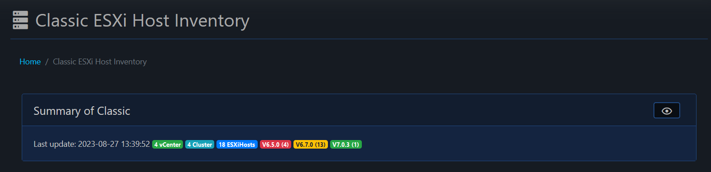

At the next you can search for an ESXiHosts. Enter the name of the ESXiHost in the search box and press submit.

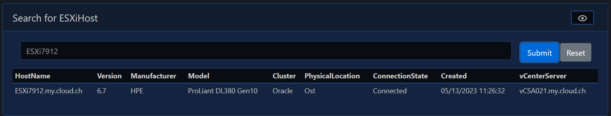

Here you can view, add, update and remove note of an ESXiHost.

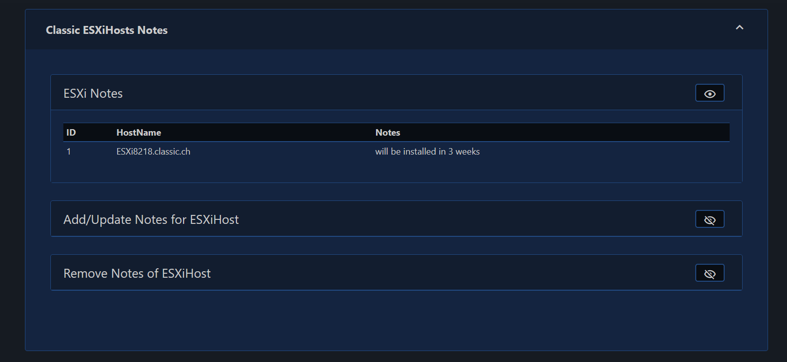

To add or update notes, enter the name of the ESXiHost and all Hosts of the ESXiHosts-table will be listet in the Dropdown, choose the one to edit and enter the note and press submit.

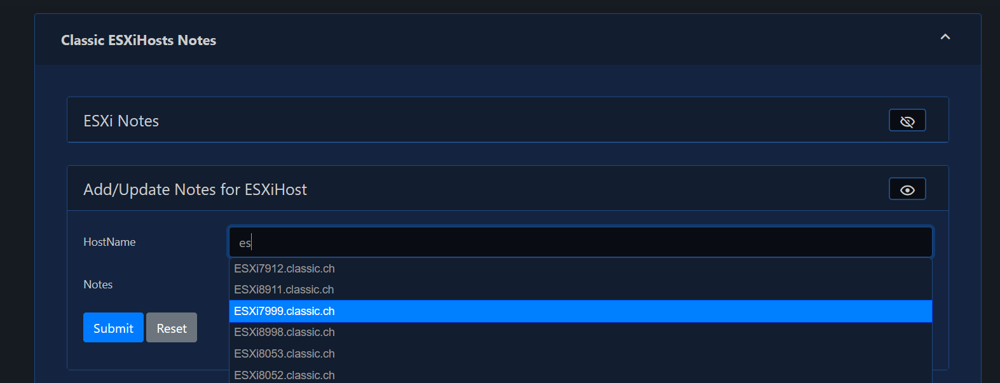

To delete the notes of an ESXiHost, enter the name of the ESXiHost and all Hosts of the ESXiHosts-table will be listet in the Dropdown, choose the one to remove the notes and press submit.

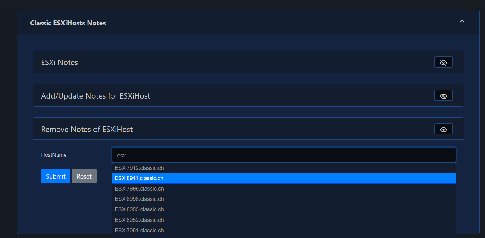

Each ESXiHosts of the Classic will be grouped by their vCenter Server.
 
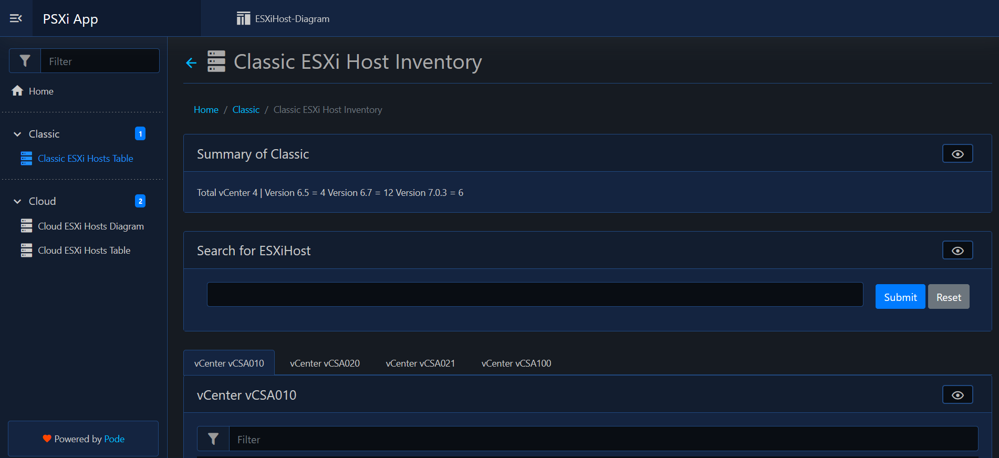

Each vCenter of the Cloud has it own tab where you can find all ESXiHosts.

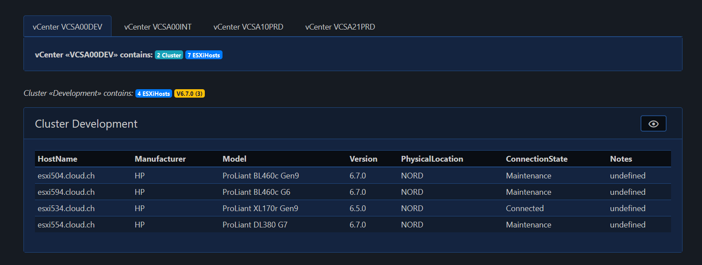

If you click at the row of an ESXiHost, all fileds of the selected ESXiHost will be showed as Sticky-note.

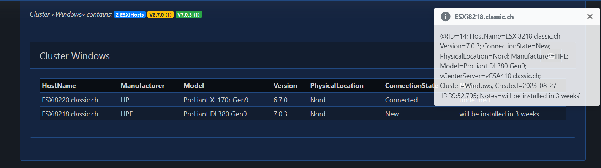

## Mermaid Diagram

For each zones, there is a Mermaid-Class-Diagram for each vCenter. 

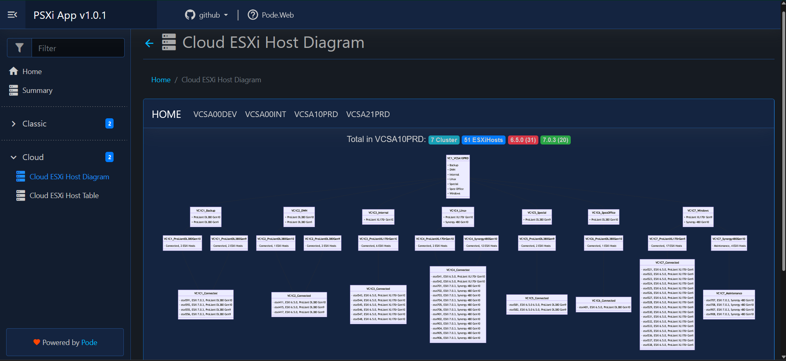

The Diagram is an iFrame to another page and it will be automatically genereate, if you upload a new CSV-file into the folder where the FileWatcher is configured.

[Top](#)

## See also

[SQLite Tutorial](https://www.sqlitetutorial.net)

[Top](#)
