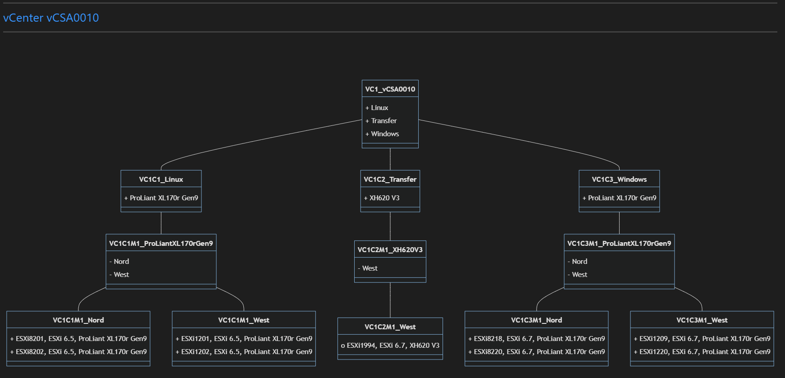
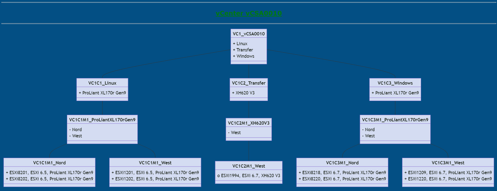
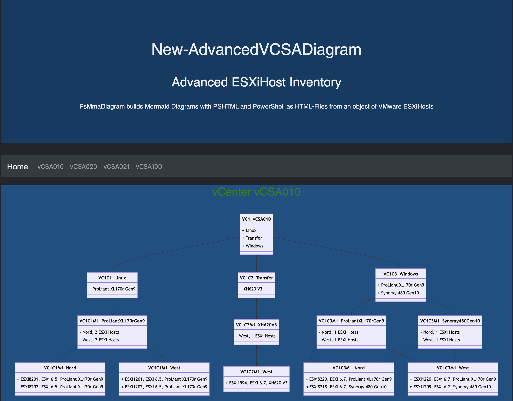

# PsMmaDiagram

PsMmaDiagram builds Mermaid Diagrams with PowerShell as Markdown- or HTML-Files from an object of VMware ESXiHosts.

## Simple Class Diagram

Build a simple Class Diagram from an object of VMware ESXiHosts.

### Markdown Diagram

Import the data from a CSV and create a Mermaid-Class-Diagram with the content of the CSV as Markdown.

- Semicolon-Delimiter
- Title 'Simple ESXiHost Inventory'

````PowerShell
Set-Location .\PsMmaDiagram\bin
$Parameters = @{
    InputObject = Import-Csv -Path ..\data\inventory.csv -Delimiter ';'
    Title       = 'Simple ESXiHost Inventory'
}
.\New-SimpleVCSADiagram.ps1 @Parameters
````



### HTML Diagram

Import the data from a CSV and create a Mermaid-Class-Diagram with the content of the CSV as Html.

- Semicolon-Delimiter
- Title 'Simple ESXiHost Inventory'

CSS and Html is inside the Html-Page and the Computer must have access to the Internet to mermaid.min.js to format the Diagrams.

````PowerShell
Set-Location .\PsMmaDiagram\bin
$Parameters = @{
    InputObject = Import-Csv -Path ..\data\inventory.csv -Delimiter ';'
    Title       = 'Simple ESXiHost Inventory'
    Html        = $true
}
.\New-SimpleVCSADiagram.ps1 @Parameters 
````



## Advanced Class Diagram

Build Mermaid Diagrams with PSHTML and PowerShell as HTML-Files from an object of VMware ESXiHosts.

Import the data from a CSV and create a Mermaid-Class-Diagram with the content of the CSV as Html with PSHTML.

All libraries are included in the project in the assets-folder and no access to the Internet is needed.

- Semicolon-Delimiter
- Title 'Advanced ESXiHost Inventory'

````PowerShell
Set-Location .\PsMmaDiagram\bin
$Parameters = @{
    InputObject = Import-Csv -Path ..\data\inventory.csv -Delimiter ';'
    Title       = 'Advanced ESXiHost Inventory'
}
.\New-AdvancedVCSADiagram.ps1 @Parameters 
````


[Top](#)
