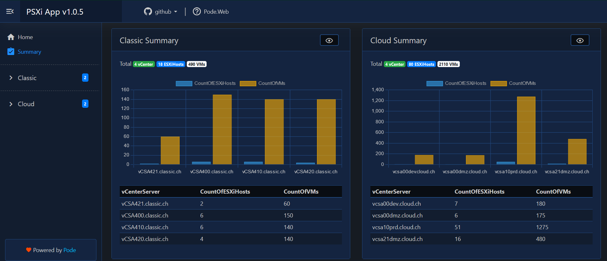

# PSXi

We currently have ~150 ESXi Hosts across 12 vCenters in our environemnt. Whenerver I'm done with the visualization of it, it's already wrong and I can start again. Why doesn't PowerShell do this for me? That's why I wrote this framework.

- [PSXiDiag](#psxidiag)
  - [How it works](#how-it-works)
  - [PSXi Home Page](#psxi-homepage)
  - [PSXi ESXi Inventory](#psxi-esxi-inventory)

## How it works

ScriptRunner runs scheduled PowerShell-Scripts to collect all the data of all vCenters and send it over WinRM as CSV-files to the Pode-Server. The Pode-Server has a FileWatcher where it check for new CSV-files.

The content of the CSV-file will be stored in a SQLite DB in seperated tabels for Cloud and Classic. You can access over Pode.Web to the SQLite DB and get the properties of Cloud-/Classic ESXiHosts.

## PSXi Homepage

This is the Homepage of the PSXi App. It shows you the summary of all vCenter, ESXiHosts and VMs.

## PSXi ESXi Inventory

If you click on this page, all ESXi Hosts of the Cloud will be grouped by vCenterServer.

In the Summary, you can see the total of vCenter, and the count of each ESXiHost versions.

You can search for the ESXiHost in the search box.

Each vCenter has it own tab where you can find all ESXiHosts.

[Top](#)
