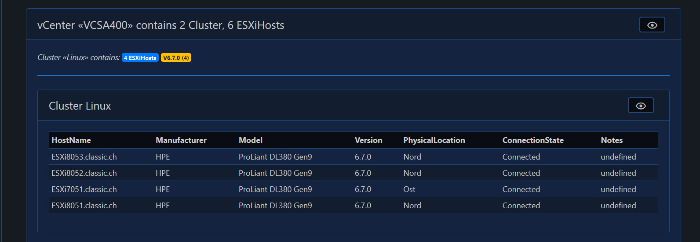

# PSXi

We currently have ~150 ESXi Hosts across 12 vCenters in our environemnt. Whenerver I'm done with the visualization of it, it's already wrong and I can start again. Why doesn't PowerShell do this for me? That's why I wrote this framework.

- [PSXiDiag](#psxidiag)
  - [PSXi Home Page](#psxi-home-page)
  - [PSXi ESXi Inventory](#psxi-esxi-inventory)

## PSXi Home Page

This is the Homepage of the PSXi App. It shows you the workflow of the data.

## PSXi ESXi Inventory

If you click on this page, all ESXi Hosts of the Cloud will be grouped by vCenterServer. The datas are stored in a SQLite database.

[Top](#)
