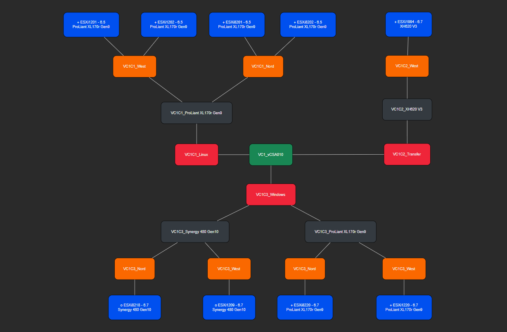

# PSXiDiag

We currently have ~130 ESXi Hosts across 8 vCenters in our environemnt. Whenerver I'm done with the visualization of it, it's already wrong and I can start again. Why doesn't PowerShell do this for me? That's why I wrote this framework.

PSXiDiag builds VMware ESXiHost Inventory Diagrams with PowerShell and save it as Markdown-, or HTML-File with Mermaid Diagrams or as CSV-File for Draw.IO-Import.

- [PSXiDiag](#psxidiag)
  - [Markdown Class Diagram](#markdown-class-diagram)
  - [HTML Class Diagram](#html-class-diagram)
  - [PSHTML Class Diagram](#pshtml-class-diagram)
  - [Draw.io Diagram](#drawio-diagram)

The following fields are required for each diagram:

HostName|Version|Manufacturer|Model|vCenterServer|Cluster|PhysicalLocation|ConnectionState
-|-|-|-|-|-|-|-
ESXi7912.my.company.ch|6.7|HPE|ProLiant DL380 Gen10|vCSA021.my.company.ch|Oracle|Ost|Connected
ESXi8911.my.company.ch|7.0.3|HPE|ProLiant DL380 Gen10|vCSA021.my.company.ch|Windows|Nord|Connected

## Markdown Class Diagram

---

Build a simple Class Diagram from an object-array of VMware ESXiHosts as Markdown-File.


Import the data from a CSV-file and create a Mermaid-Class-Diagram with the content of the object and save it as Markdown.

````PowerShell
Set-Location .\PSXiDiag\bin
$Parameters = @{
    InputObject = Import-Csv -Path ..\data\inventory.csv -Delimiter ';'
    Title       = 'Markdown ESXiHost Inventory'
}
.\New-VCSADiagram.ps1 @Parameters
````

[Top](#)

## HTML Class Diagram

---

Build a simple Class Diagram from an object-array of VMware ESXiHosts as HTML-File.


Import the data from a CSV-file and create a Mermaid-Class-Diagram with the content of the object save it as Html.

CSS and Html is inside the Html-Page and the Computer must have access to the Internet to mermaid.min.js to format the Diagrams. This file can be used to send as email.

````PowerShell
Set-Location .\PSXiDiag\bin
$Parameters = @{
    InputObject = Import-Csv -Path ..\data\inventory.csv -Delimiter ';'
    Title       = 'HTML ESXiHost Inventory'
    Html        = $true
}
.\New-VCSADiagram.ps1 @Parameters 
````

[Top](#)

## PSHTML Class Diagram

---

[PSHTML is a cross platform powershell module that allows to renders HTML using powershell syntax](https://pshtml.readthedocs.io/en/latest/)

````PowerShell
Install-Module PSHTML, Pode
````

Build a simple Class Diagram from an object-array of VMware ESXiHosts. It use PSHTML and BootStrap for the layout of the Page and Pode web server.


Import the data from a CSV-file and create a Mermaid-Class-Diagram with the content of the object as Html with PSHTML.

All libraries are included in the project in the assets-folder and no access to the Internet is needed, but the whole project must be installed on the target(s) where you open the file.

````PowerShell
Set-Location .\PSXiDiag\bin
$Parameters = @{
    InputObject = Import-Csv -Path ..\data\inventory.csv -Delimiter ';'
    Title       = 'PSHTML ESXiHost Inventory'
    Pshtml      = $true
}
.\New-VCSADiagram.ps1 @Parameters 
````

[Top](#)

## Draw.io Diagram

---

Build an input-file from an object-array of VMware ESXiHosts for import in to DrawIO.

Create CSV-File(s) to [import into draw.io](https://drawio-app.com/import-from-csv-to-drawio/). The CSV-File(s) will be stored under ..\data.



````PowerShell
Set-Location .\PSXiDiag\bin
$Parameters = @{
    InputObject = Import-Csv -Path ..\data\inventory.csv -Delimiter ';'
    Title       = 'DrawIO ESXiHost Inventory'
    DrawIO      = $true
}
.\New-VCSADiagram.ps1 @Parameters 
````

Open Draw.IO -> Create New Diagram -> Choose Blank Diagram -> Arrange -> Insert -> Advanced -> CSV...

Copy and paste the Content of the created CSV-File into the Form-Filed and press Import. Arrange the elements as you like.

[Top](#)
