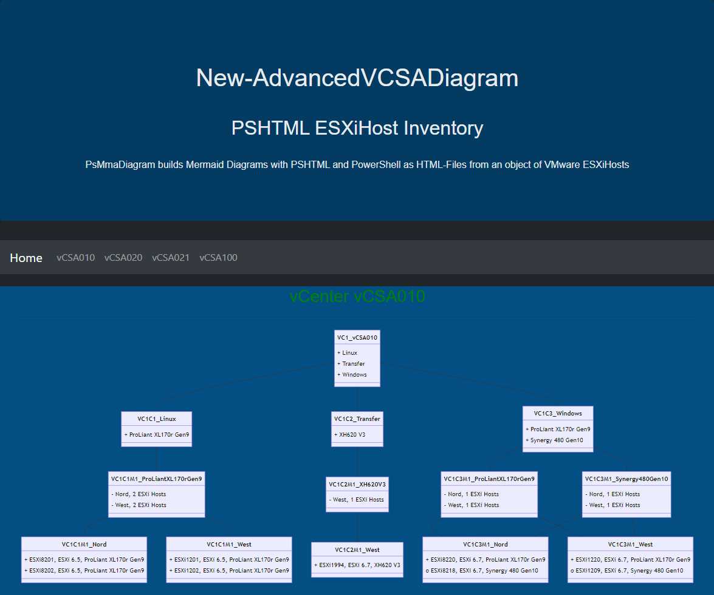

# PsMmaDiagram

PsMmaDiagram builds Mermaid Diagrams with PowerShell as Markdown- or HTML-Files from an object of VMware ESXiHosts.

## Simple Class Diagram

Create a simple Class Diagram from an object of VMware ESXiHost Inventory.

### Markdown Diagram

Import the data from a CSV and create a Mermaid-Class-Diagram with the content of the CSV as Markdown.

- Semicolon-Delimiter
- Title 'Simple ESXiHost Inventory'

````PowerShell
.\bin\New-SimpleVCSADiagram.ps1 -InputObject (Import-Csv -Path ..\data\inventory.csv -Delimiter ';') -Title 'Simple ESXiHost Inventory'
````


### HTML Diagram

Import the data from a CSV and create a Mermaid-Class-Diagram with the content of the CSV as Html.

- Semicolon-Delimiter
- Title 'Simple ESXiHost Inventory'

CSS and Html is inside the Html-Page and the Computer must have access to the Internet to "https://cdnjs.cloudflare.com/ajax/libs/mermaid/8.13.4/mermaid.min.js" to format the Mermaid-Diagrams.

````PowerShell
.\bin\New-SimpleVCSADiagram.ps1 InputObject (Import-Csv -Path ..\data\inventory.csv -Delimiter ';') -Title 'Simple ESXiHost Inventory' -Title 'ESXiHost Inventory' -Html
````


## Advances Class Diagramm

Builds Mermaid Diagrams with PSHTML and PowerShell as HTML-Files from an object of VMware ESXiHosts.

Import the data from a CSV and create a Mermaid-Class-Diagram with the content of the CSV as Html with PSHTML.

- Semicolon-Delimiter
- Title 'Advanced ESXiHost Inventory'

````PowerShell
.\bin\New-AdvancedVCSADiagram.ps1 -InputObject (Import-Csv -Path ..\data\inventory.csv -Delimiter ';') -Title 'Advanced ESXiHost Inventory'
````


[Top](#)
