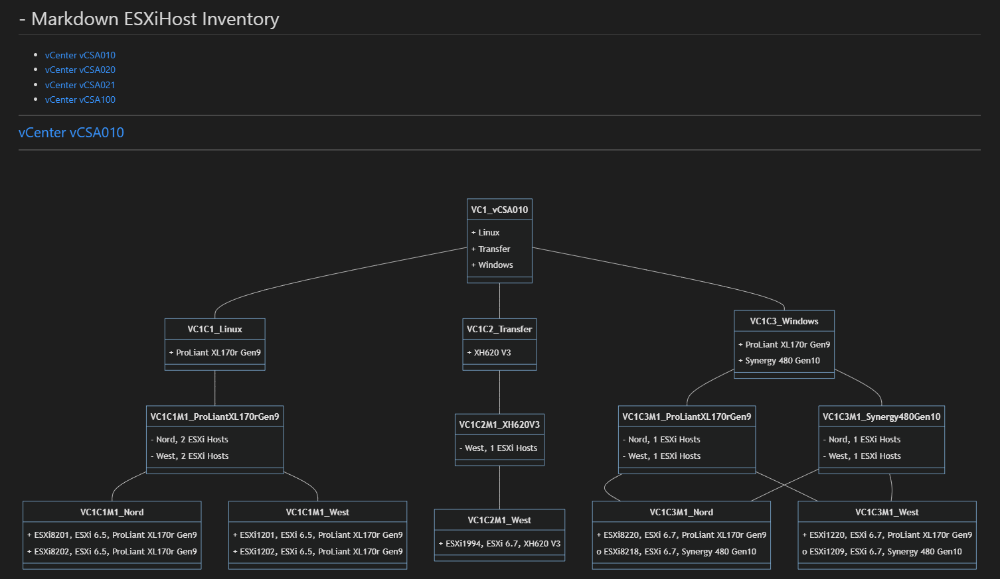

# PsMmaDiagram

Create Mermaid Diagrams with PowerShell.

## Create a simple Class Diagram

Create a simple Class Diagram from an object of VMware ESXiHost Inventory.

### Markdown Diagram

Import the data from a CSV and create a Mermaid-Class-Diagram with the content of the CSV as Markdown.

- Semicolon-Delimiter
- Title 'ESXiHost Inventory'

````PowerShell
.\bin\New-SimpleVCSADiagram.ps1 -InputObject (Import-Csv -Path ..\data\inventory.csv -Delimiter ';') -Title 'ESXiHost Inventory'
````



### HTML Diagram

Import the data from a CSV and create a Mermaid-Class-Diagram with the content of the CSV as Html.

- Semicolon-Delimiter
- Title 'ESXiHost Inventory'

CSS and Html is inside the Html-Page and the Computer must have access to the Internet to "https://cdnjs.cloudflare.com/ajax/libs/mermaid/8.13.4/mermaid.min.js" to format the Mermaid-Diagrams.

````PowerShell
.\bin\New-SimpleVCSADiagram.ps1 InputObject (Import-Csv -Path ..\data\inventory.csv -Delimiter ';') -Title 'ESXiHost Inventory' -Title 'ESXiHost Inventory' -Html
````


## Create an Advances Class Diagramm

Create an advanced Class Diagram from an object of VMware ESXiHost Inventory.

To Do:

- Switch from single-html-file to BootStrap.

[Top](#)
