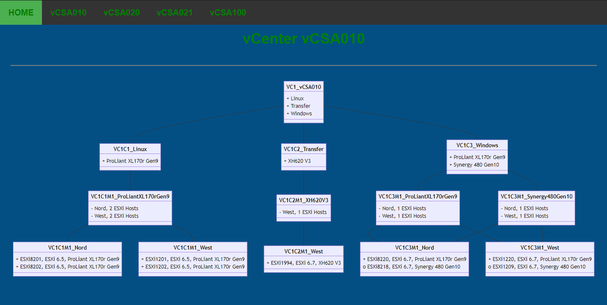

# PsMmDiagram

Create Mermaid Diagram with PowerShell

## Create a simple Class Diagram

Create a Class Diagram from a CSV-File base on a VMware ESXiHost Inventory.

### Markdown Diagram

Import-Csv with the Semicolon-Delimiter and create the Mermaid-Diagram with the content of the CSV and the Title 'ESXiHost Inventory' as Markdown:

````PowerShell
.\bin\New-SimpleVCSADiagram.ps1 -InputObject (Import-Csv -Path ..\data\inventory.csv -Delimiter ';') -Title 'ESXiHost Inventory'
````


### HTML Diagram

Import-Csv with the Semicolon-Delimiter and create the Mermaid-Diagram with the content of the CSV and the Title 'ESXiHost Inventory' as Html.

CSS and Html is inside the Html-Page and the Computer must have access to the Internet to "https://cdnjs.cloudflare.com/ajax/libs/mermaid/8.13.4/mermaid.min.js" to format the Mermaid-Diagrams.

````PowerShell
.\bin\New-SimpleVCSADiagram.ps1 InputObject (Import-Csv -Path ..\data\inventory.csv -Delimiter ';') -Title 'ESXiHost Inventory' -Title 'ESXiHost Inventory' -Html
````



## Create a Class Diagramm with a BootStrap-Page

To Do

[Top](#)
