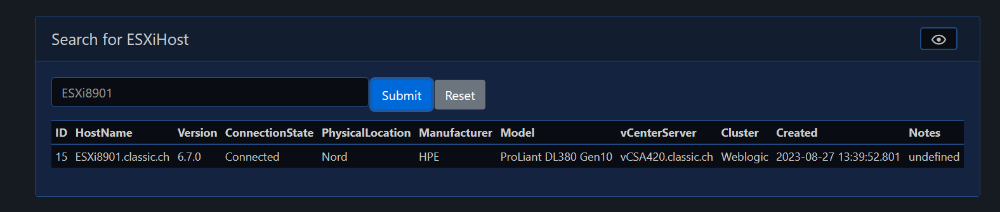

# PSXi

We currently have ~150 ESXi Hosts across 12 vCenters in our environemnt. Whenerver I'm done with the visualization of it, it's already wrong and I can start again. Why doesn't PowerShell do this for me? That's why I wrote this framework.

- [PSXiDiag](#psxidiag)
  - [How it works](#how-it-works)
  - [PSXi Homepage](#psxi-homepage)
  - [PSXi Summary](#psxi-summary)
  - [PSXi ESXi Inventory](#psxi-esxi-inventory)
  - [Mermaid Diagram](#mermaid-diagram)

## How it works

ScriptRunner runs scheduled PowerShell-Scripts to collect all the data of all vCenters and send it over WinRM as CSV-files to the Pode-Server. The Pode-Server has a FileWatcher where it check for new CSV-files in /pode/input.

The file should be named:
- cloud_ESXiHosts.csv
- classic_ESXiHosts.csv
- cloud_Summary.csv
- classic_Summary.csv

The content of the CSV-file will be stored in a SQLite DB in seperated tabels for Cloud and Classic. You can access over Pode.Web to the SQLite DB and get the properties of Cloud-/Classic ESXiHosts.

## PSXi Homepage

This is the Homepage of the PSXi App. It shows you the status of the Modules and the SQLite Database.

## PSXi Summary

In the Summary, you can see the total of vCenter, and the count of each ESXiHost versions.

## PSXi ESXi Inventory

You can search for the ESXiHost in the search box in the pages Summary, Classic-/Cloud ESXi Host Table.

If you click on this page, all ESXi Hosts of the Classic will be grouped by vCenterServer.

If you cklick on this page, each vCenter of the Cloud has it own tab where you can find all ESXiHosts.

## Mermaid Diagram

For each zones, there is a Mermaid-Class-Diagram for each vCenter. 

The Diagram is an iFrame to another page and it will be automatically genereate, if you upload a new CSV-file into the folder where the FileWatcher is configured.

[Top](#)
